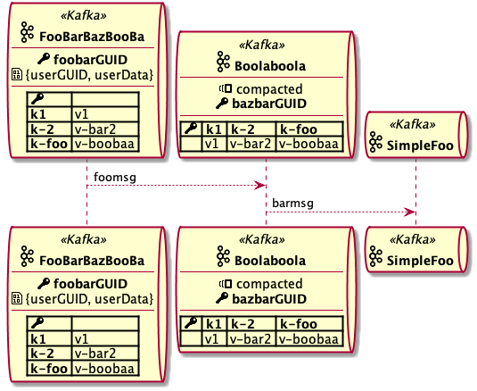

# plantuml-extensions

> Tested with PlantUML 1.2020.10

Various extensions for PlantUML

<p align="center">
    
</p>

## Usage example:

```
@startuml

!include https://raw.githubusercontent.com/jrosiek/plantuml-extensions/master/puml_ext.iuml

$puml_ext_include(extension-name)

' for example:
$puml_ext_include(art/logos16.iuml)

' ... your diagram here

@enduml
```

## Extensions

### Art

* art/octicons{16,24,32} - sprites generated from https://octicons.github.com
* art/logos{16,24,32} - sprites with various logos

### Sequence diagrams

* [sequence/kafka_topic_participant](./sequence/kafka-topic-participant.md) - create participant that represents kafka topic


### Component diagrams

* [component/kafka_topic_component](./component/kafka-topic-component.md) - create component that represents kafka topic
