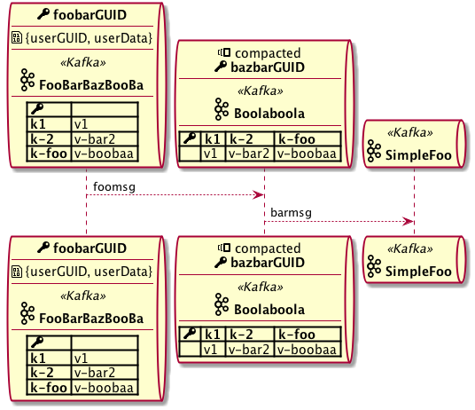

# kafka_topic_participant

#### kafka_topic_participant($id, $name, $key="", $payload="", $compacted="", $entries="", $dir="horiz")

Creates participant that represents kafka topic.

It lets you add the information what is the topic key and value and whether it is a compacted topic or not. You can also embed a list of example entries.

#### Arguments
| Parameter  | Description |
| ------------- | ------------- |
| $id  | Participant ID. Identified to be referenced on the diagram.  |
| $name  | Kafka topic name.  |
| $key  | Description of topic key.<br>**Default:** _empty_  |
| $payload  | Description of topic value payload.<br>**Default:** _empty_ |
| $compacted  | Is the topic compacted.<br>**Allowed values:** _empty_, `compacted`.<br>**Default:** _empty_ |
| $entries | List of example topic entries.<br>**Format:** _key1`:`value1`\|`key2`:`value2_<br>**Default:** _empty_ |
| $dir | Display direction for the example entries.<br>**Allowed values:** `horiz`, `vert`<br>**Default:** `horiz` |


## Usage example:

```
@startuml

!include https://raw.githubusercontent.com/jrosiek/plantuml-extensions/master/puml_ext.iuml

$puml_ext_include(sequence/kafka-topic-participant.iuml)

kafka_topic_participant(A, FooBarBazBooBa, foobarGUID, "{userGUID, userData}", "", "k1:v1|k-2:v-bar2|k-foo:v-boobaa", vert)
kafka_topic_participant(B, Boolaboola, bazbarGUID, "", compacted, "k1:v1|k-2:v-bar2|k-foo:v-boobaa")
kafka_topic_participant(C, SimpleFoo)

A --> B : foomsg
B --> C : barmsg

@enduml
```


